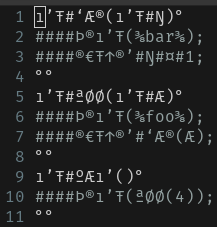

# Styx Programming Language

The Styx programming language is an esoteric, interpreted programming language primarily utilizing UTF-8 special characters, resulting in code that is inherently hard to read. Its syntax is inspired by the C programming language. The Styx interpreter is written in C and uses "flex" and "bison" as lexer and parser generators. During the parsing process, the interpreter constructs an abstract syntax tree (AST) and subsequently executes it. This README provides an overview of the Styx programming language, its syntax, and instructions for building the interpreter.

The project was created as a university submission, so there are also several exercise solutions made with flex/bison.
The main project is located in the sudy_project directory.

<p align="center">
  
</p>


## Table of Contents

- [Getting Started](#getting-started)
- [Syntax](#syntax)
- [Examples](#examples)
- [License](#license)


## Getting Started

To get started with the Styx programming language, you can follow the instructions below. Make sure you have the required dependencies installed on your system.


### Prerequisites

- C compiler (e.g., GCC)
- Flex
- Bison


### Installation

- Clone the Styx repository to your local machine:

   ```shell
   git clone https://github.com/Finn-Artmann/Styx.git
   ```


### Building the Interpreter

  ```shell
   cd Styx/study_project
   make
   ```

### Usage

  Run the binary in the bin folder
  ```shell
   cd Styx/study_project/bin
   ./styx <your_styx_program>.styx
   ```


## Syntax
Please refer to the description in this [PDF](study_project_description/study_project_description.pdf) for information about the syntax as well as a short description of the project and its features.

Hint: Since you are probably not yet fluent in reading *styx* language, you might want to take a look at the [lexer file](study_project/src/styx.l) where all the symbols are defined.
      Feel free to change them to your liking and rebuild the interpreter. 


## Examples

The following examples can be found in the [styx folder](study_project/styx):

- **Language demo**
   The language demo is supposed to demonstrate some of specifics os SŦYX.
   The demo should show how they are used and that they are functional.
   For each feature there is a a separate function that is called from the main.

- **Guess my number**
  Guess the computers number between 0 and 100 with a limited number of tries.

- **Fibonacci series**
  Calculate the fibonacci series for a given number of steps. The result will be displayed as an Integer as well as in stars.

- **Multiplication table**
  Displays a multiplication table for a given number.

- **Todo list**
  Add, read and remove items from a todo list and store it to a file.


## Licence
This project is licenced under GPLv3. 


